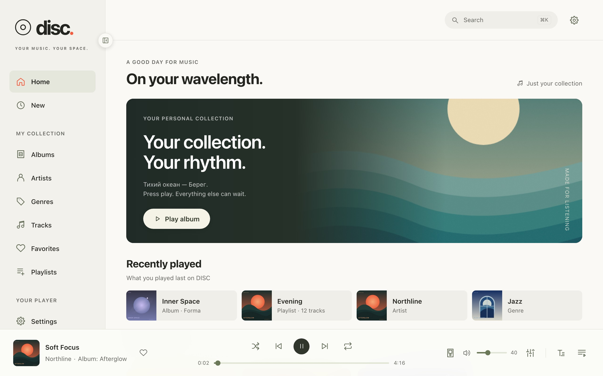
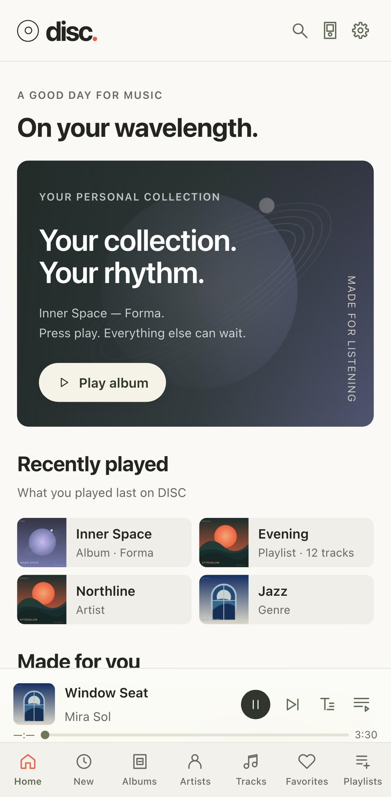
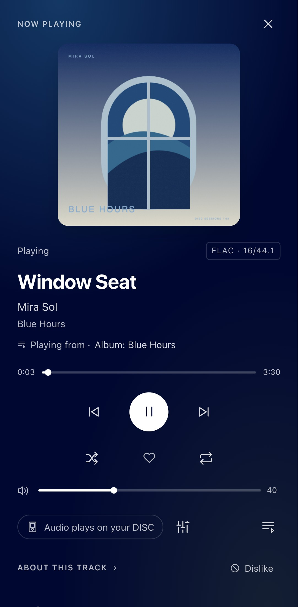
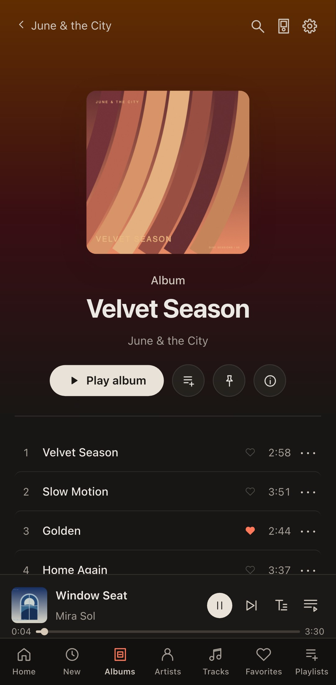
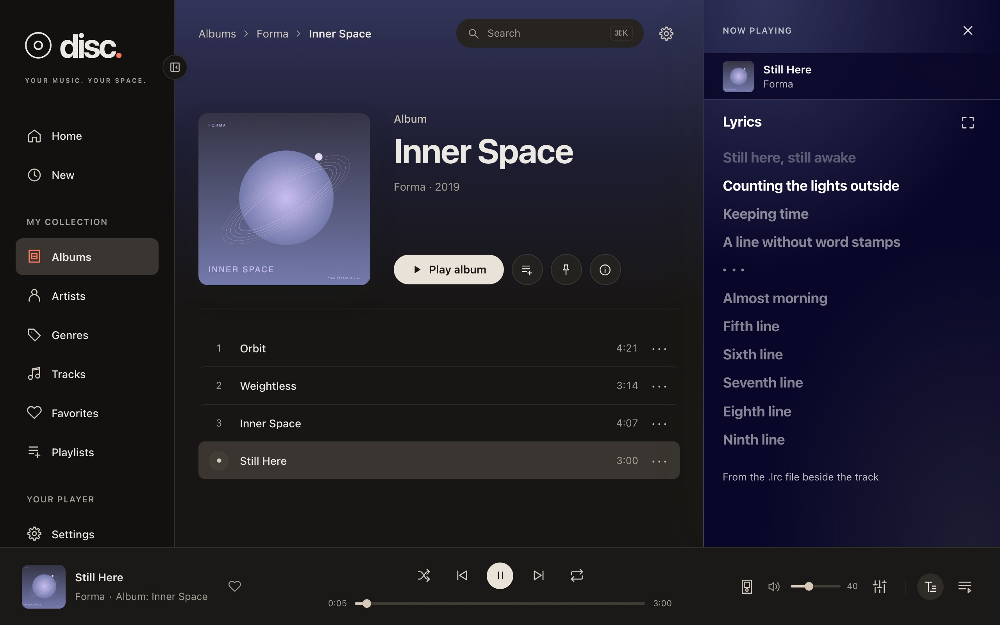
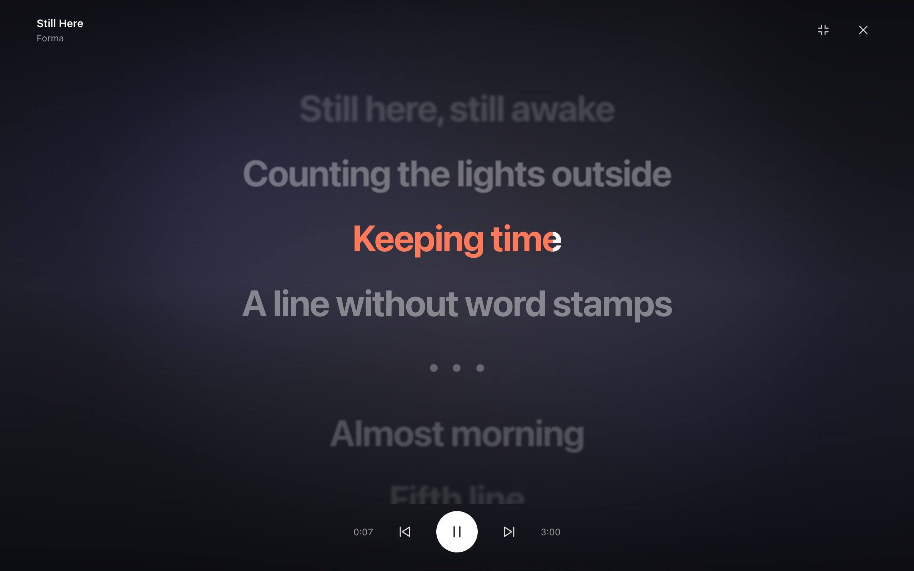
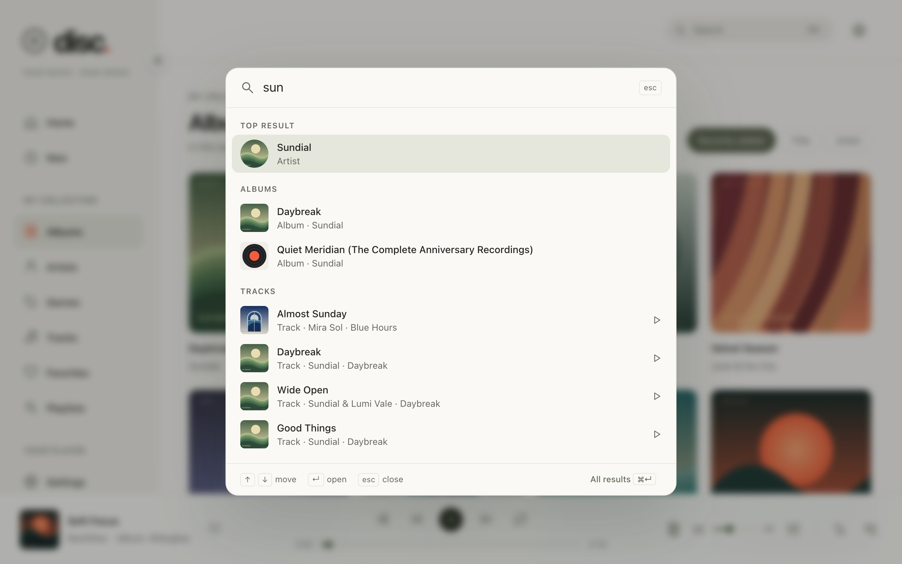
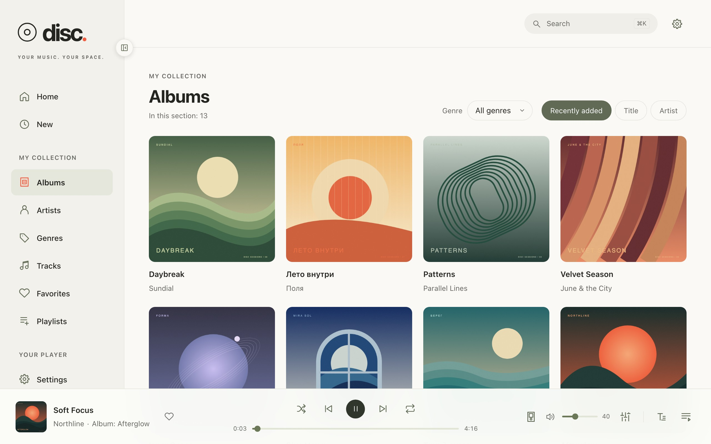
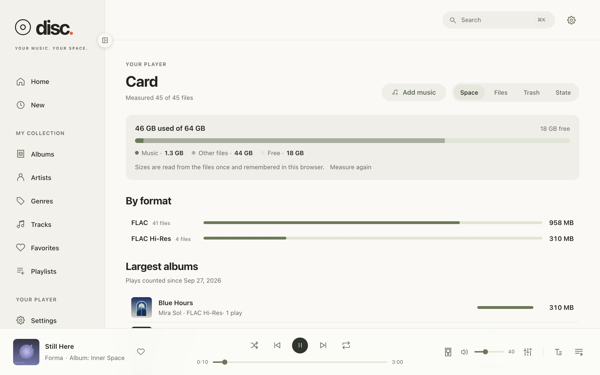
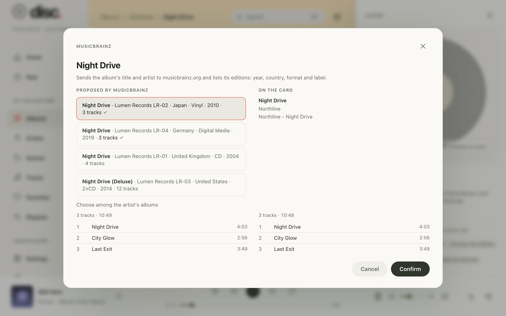

# Disc Player

**Your SNOWSKY DISC's music in every browser at home: on the computer, the
tablet and the phone.**

Disc Player is an unofficial music app that lives on the player's own memory
card. Open the player's address on your Wi-Fi and the whole collection is
there: browse it, start an album, follow the lyrics, find the covers it lacks
and keep the card in order. The music plays on the DISC, or moves to the
browser with one switch.

[What you can do](#what-you-can-do) · [A closer look](#a-closer-look) ·
[What you need](#what-you-need) · [Changelog](CHANGELOG.md) ·
[Releases](https://github.com/eudj1n/snowsky-disc-player/releases)

  

<table>
  <tr>
    <td align="center"></td>
    <td align="center"></td>
    <td align="center"></td>
  </tr>
  <tr>
    <td align="center"><b>Your collection at a glance</b></td>
    <td align="center"><b>A full player in your hand</b></td>
    <td align="center"><b>Each album in its colours</b></td>
  </tr>
</table>

_Screenshots of the fictional demo collection, not of anyone's library
([about the pictures](docs/images/README.md))._

## What you can do

| Capability              | What you get                                                                                                                                                                                                                 |
| ----------------------- | ---------------------------------------------------------------------------------------------------------------------------------------------------------------------------------------------------------------------------- |
| **Browse and search**   | Home, New, albums, artists, genres, tracks, favorites and playlists, sorted and filtered your way. Press `/` or ⌘K and type: tracks, albums, artists and playlists appear as you type.                                       |
| **Play on the DISC**    | Albums, artists, genres, playlists and folders; the queue, seek, volume, shuffle, repeat and favorites. Every change is checked against the player's own answer.                                                             |
| **Play in the browser** | One switch moves the track, its position and the queue to the browser and back. Full screen, the cover turns as a disc and the spectrum spreads around it.                                                                   |
| **Lyrics and karaoke**  | Lyrics beside the track, following the song when they are synced; karaoke full screen, word by word. Missing lyrics can be found on LRCLIB and saved beside the track.                                                       |
| **Covers and artists**  | Covers from Cover Art Archive, artist photos and backgrounds from fanart.tv (with your own free key) and Wikimedia Commons, with their authors and licences. MusicBrainz tells which artist and which edition each album is. |
| **Your listening**      | What you played, on the player and in the browser; automatic playlists (Most played, Daily mix, Recently added, Not played lately) kept on the player; pins and dislikes.                                                    |
| **The card**            | Upload music and album folders, then let the player scan; see what takes space, browse and play folders, move files to the trash and back.                                                                                   |
| **The library's state** | What the collection lacks (identities, covers, images, lyrics, unknown tags, duplicates, unreadable files) and one run that fills it in, step by step or automatically, undoable as a whole.                                 |
| **Sound**               | Gain, balance, the DAC filter and DRE, applied on the player.                                                                                                                                                                |
| **Make it yours**       | Light and dark themes in four tones each, four text sizes, English and Russian; more contrast and reduced transparency follow your system.                                                                                   |

## A closer look

### Lyrics that follow the song

Synced lyrics keep the current line in view; tap a line to jump there. In
karaoke the line fills word by word where the lyrics file has word timings,
and a pause shows three dots that fill until the next line.

<table>
  <tr>
    <td align="center"></td>
    <td align="center"></td>
  </tr>
</table>

### Find anything as you type

One box for the whole collection: case and accents do not matter, Enter
opens a result or plays a track, and the same box runs commands (go to a
section, switch the theme, add music, sound settings).

<table>
  <tr>
    <td align="center"></td>
    <td align="center"></td>
  </tr>
</table>

### Your card, in order

See what takes space on the card, find the possible duplicates and move what
you do not need to the trash. The State tab counts what the library lacks and
enriches it in one run: when you choose an album's edition, its tracks stand
beside the album's own on the card, and what differs is marked.

<table>
  <tr>
    <td align="center"></td>
    <td align="center"></td>
  </tr>
</table>

## Privacy and safety

There is no account, no cloud and no analytics. The page talks to the player
that served it; outside sources (MusicBrainz, Cover Art Archive, LRCLIB,
fanart.tv, Wikimedia Commons) stay off until you allow each one under
Settings → External sources, and then receive only what the page needs to ask
them, such as an album's title and artist. Pins, play history, automatic
playlists, identities and chosen pictures are kept on the player; theme,
language and text size stay in the browser.

Changing anything on the player takes its serial number, entered once in
this browser. The player accepts only the commands its reviewed list allows,
and a command whose result is unknown is never repeated by itself.

## What you need

- A SNOWSKY DISC with firmware V2.57, running the DISC boot layer
  ([snowsky-disc-boot](https://github.com/eudj1n/snowsky-disc-boot)) and its
  server ([snowsky-disc-server](https://github.com/eudj1n/snowsky-disc-server)),
  which serves Disc Player from the card. Both are in development; their
  documentation will describe the installation.
- The player on your Wi-Fi network (set up on the player itself).
- A current browser on a computer, tablet or phone on the same network.

## Use

1. Open the player's address, `http://<player-ip>:7870/`, in a browser on the
   same network.
2. Press **Connect**. One client controls the player at a time: disconnect
   the FiiO app or another page first.
3. To control playback, open **Pairing** and enter the player's serial number
   (SN, under About device on the player). It is kept in this browser only.
   After five wrong attempts the player refuses pairing from that device for
   ten minutes.

The page starts in the player's own language when it is Russian or English.
Language, theme and text size are on the Settings page (the gear in the top
bar).

## For developers

Start with [AGENTS.md](AGENTS.md), the [architecture](docs/architecture.md),
the [development guide](docs/development.md) and the
[release guide](docs/release.md); the [plan](docs/plan.md) records what was
done and why.

## License & scope

Independent project, not affiliated with or endorsed by FiiO or SNOWSKY.
[MIT licensed](LICENSE). The demo collection and its covers come from the
DISC Web demo of
[snowsky-disc-qemu](https://github.com/eudj1n/snowsky-disc-qemu) (MIT):
original, fictional names and artwork.
