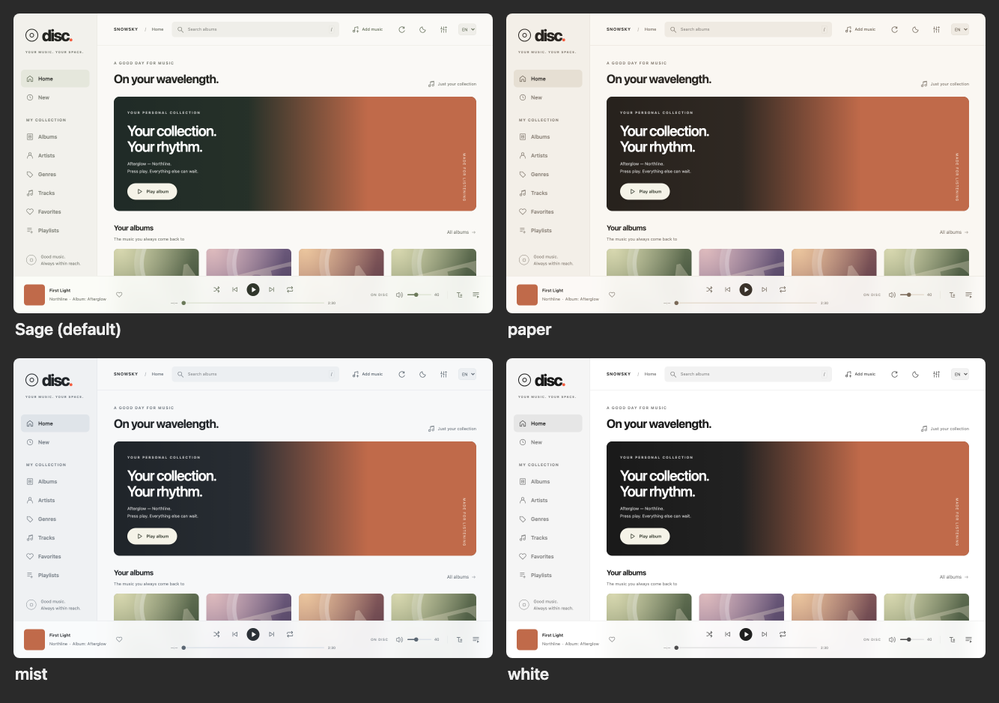
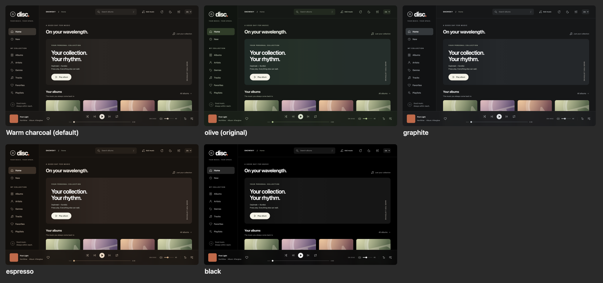
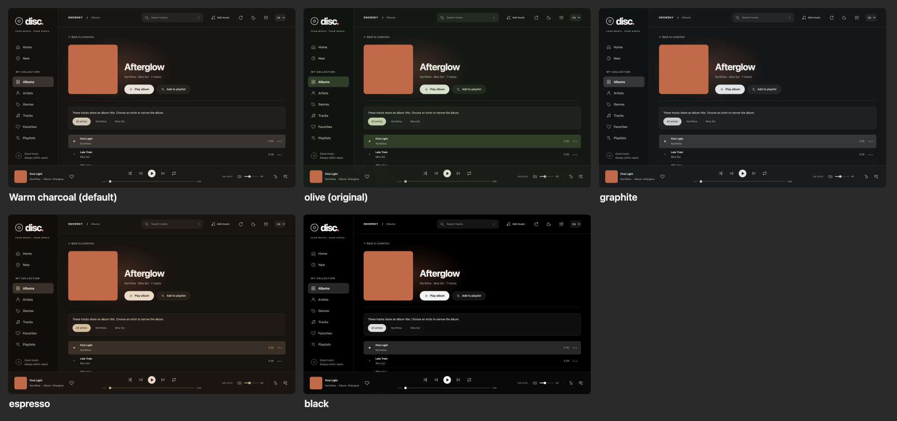

# Themes and dark palettes

The page has a light and a dark theme (`data-theme` on `<html>`, chosen in the
appearance dialog or following the system). Colors are CSS tokens in
`src/styles/main.css`; components use them through Tailwind theme colors
(`bg-strong`, `text-chip-on-ink`, …) or `var(--token)`, never literal dark
colors, so a palette changes the whole theme at once.

## Palettes

Each theme has several palettes; the appearance dialog shows them as swatches
under "Light theme tone" and "Dark theme tone" and keeps the choice in this
browser (`disc-player.light-palette`, `disc-player.dark-palette`).
`public/theme.js` applies it before the stylesheet paints, and the store
(`src/stores/appearance.ts`) sets `data-light-palette` / `data-dark-palette` on
`<html>`; the default of each theme sets no attribute. The catalog with the
dialog's swatch colors is `src/domain/palettes.ts`.

On 2026-09-26 the owner chose **warm charcoal** as the default dark palette
after comparing five, and asked for light alternatives next to the original
sage.

| Theme | Palette       | Attribute value | Character                                    |
| ----- | ------------- | --------------- | -------------------------------------------- |
| Light | Sage          | (default)       | The original light theme, green-grey accents |
| Light | Paper         | `paper`         | Warm cream with brown ink                    |
| Light | Mist          | `mist`          | Cool grey-blue                               |
| Light | White         | `white`         | Neutral, near monochrome                     |
| Dark  | Warm charcoal | (default)       | Grey with a brown undertone, cream buttons   |
| Dark  | Olive         | `olive`         | The original dark theme, green accents       |
| Dark  | Graphite      | `graphite`      | Neutral cool dark grey                       |
| Dark  | Espresso      | `espresso`      | Brown, cream buttons                         |
| Dark  | Black         | `black`         | True black for OLED, nearly monochrome       |

The coral accent (`--accent`) stays in every palette.

The screenshots use the mock collection (`tests/e2e/mock-collection.mjs`), not
a real library.

## Tokens a palette sets

Surfaces and text: `--paper`, `--surface`, `--raised`, `--soft`, `--hover`,
`--selected`, `--line`, `--ink`, `--muted`, `--secondary`, `--banner`,
`--banner-ink`, `--progress-bg`, `--progress-fill`, `--player-bg`.
Primary buttons (play, pill buttons): `--strong`, `--strong-hover`,
`--strong-ink`. Pressed filters and chips: `--chip-on`, `--chip-on-ink`.
Decorative art (device illustration, home rings, online dot): `--art-a`,
`--art-b`, `--art-edge`, `--art-edge-2`, `--ring-edge`, `--ring-a`…`--ring-d`,
`--online-ring`. The dark banner and toasts: `--hero`, `--hero-from`,
`--hero-mid`, `--toast`. The search focus ring: `--focus-ring`.

A new palette copies one block of `palettes.css`, changes the values and keeps
every token (a token left out falls back to the theme's default palette), then
gets an entry with swatch colors in `src/domain/palettes.ts` and a name in both
languages.
